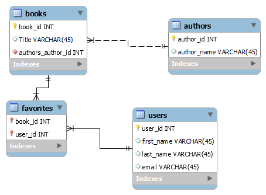

# Books Project

Brittany Lassiter

## Consider the following "flat" file that a start-up has just started using for its first customers. Saving this much information in .csv format will not meet their needs once they started to expand. Creating a relational database to meet their needs. 

## Data was provided by Coding Dojo's Data science program [Original File](https://docs.google.com/spreadsheets/d/1uVH2ETvkVxQecG7N4jnbprVnTTlmuZfmY6jQVFkv9V0/edit#gid=0)

 ## Information
 - Designed ERD, using MYSQL Workbench, to represent a database that tracks users and their favorite books.
 - Generate Forward Engineering Script, to export the .SQL creation script to be saved in assignment's repository.
 - Insert data into the database with Python, while using Jupyter Notebook.
 - Wrote a query in the notebook to list titles to make sure your connections and tables/columns are accurate.

   

 
